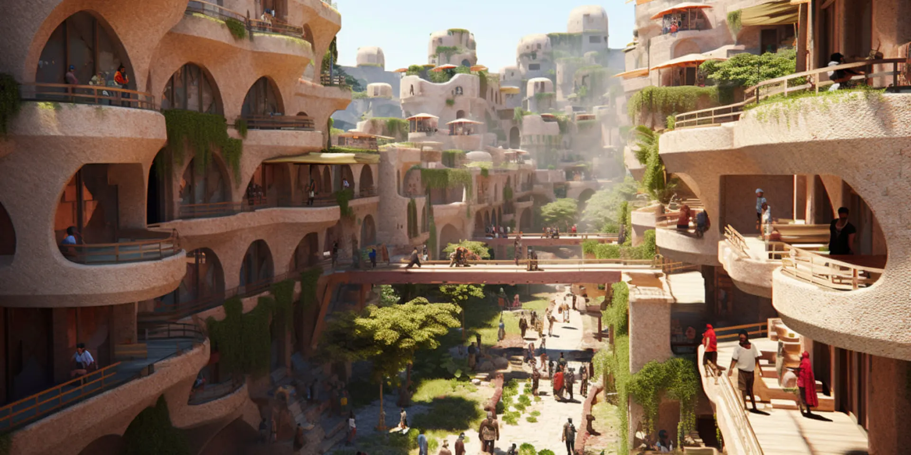

# Welcome | Karibu

Taking place between July 20th and July 23rd, this special gathering in Zanzibar unites top innovators and investors supporting human flourishing, with a special focus on science and technology that will lay the foundation for Africa’s future.

This resource is meant to be an evolving guide for the gathering in July. If you have things you'd like to add, please [get in touch with Sam](https://t.me/samtaggart).

The official event location is Jungle Paradise Resort & Spa, also known as Mbweni Ruins.

## Helpful Links

- [Event Page, RSVP, & Payment](https://lu.ma/zanzibar_regen)
- [Event Attendee Questionnaire](https://forms.gle/a4n4iXG1xqK4j5Bj9)
- [Learn Swahili | Basics](https://www.tripsavvy.com/swahili-or-kiswahili-for-travelers-1454482)
- [Learn Swahili | Advanced](https://2seedsswahili.wordpress.com/)